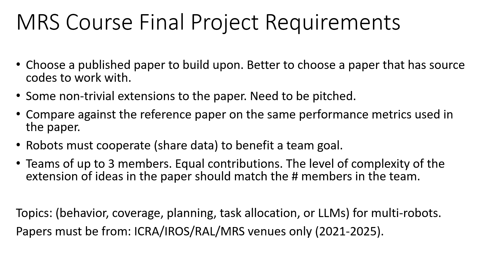

# im_sync

#### Author: Jacob Kruse

This package contains all of the code for my Final Project in CSCI 8535: Multi Robot Systems

### Project Description

The paper I chose to extend to satisfy the project requirements is titled *"Voronoi-based Coverage Control with Connectivity Maintenance for
Robotic Sensor Networks"*. I have included this research paper in the `/doc` folder of this repository, and it can be viewed at the link below.  
[View Research Paper PDF](https://github.com/jacob-kruse/im_sync/blob/main/doc/Extended_Paper.pdf)

**Paper Citation**  
W. Luo and K. Sycara, “Voronoi-based coverage control with connectivity maintenance for robotic sensor networks,” in Proc. 2019 Int. Symp. on Multi-Robot and Multi-Agent Systems (MRS). IEEE, 2019.

The final report I completed for this project is located in the `/doc` folder of this repository and can be viewed at the link below.  
[View Final Report PDF](https://github.com/jacob-kruse/im_sync/blob/main/doc/Final_Report.pdf)

### Demo Video

The above shows a preview for the demo video. The video provides a demonstration of my extension with comparisons to both baselines in a randomly generated scenario. Click the preview above to watch the full demo video.

### Main Code
The main code for this repository is located in the `/scripts` folder. Within this folder there are the `/coverage` and `/plotting` folders which contain code for different categories.

The `/coverage` folder contains the scripts `voronoi.py` and `connected_voronoi.py`, which provide the baselines for Standard Voronoi partitioning and the proposed partitioning from the research paper, respectively. My algorithm is `dynamic_connected_voronoi.py`, and builds on the proposed algorithm by implementing a dynamic communication range. The Python file `coverage.py` runs each of the coverage scripts one-by-one, which is useful for comparing each method with the same distribution function, especially if it is randomly generated.

The `/plotting` folder contains a number of scripts that are used to plot the data acquired from running each coverage script. The main script, `plot_data.py`, plots all of the available data in a number of ways. You can also run the other scripts independently.

In order to run these scripts, you need to install the required Python environment. This is described by the `environment.yml` in the root directory and can be installed if you have Anaconda using the following command. 

    conda env create -f environment.yml

This environment will be createed with the name "im_sync". To activate the environment use the following command.

    conda activate im_sync

Feel free to change the name of this environment by going to the `environment.yml` file and modifying the name in the first line. Make sure to adapt the command above accordingly.

### Coverage Script Data
The `/data` folder holds all of the data that is collected from running each coverage control script. The `/last` folder holds the most recent output file from each coverage script. The `/archive` folder holds all of the experimental data for past runs of each method on the same environment. If you wish to keep the data collected from a run, make sure to move it into the `/archive` folder before running the coverage scripts again because they will replace the previous output file in the `/last` folder.
